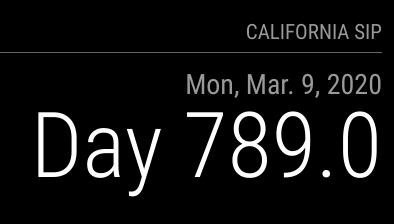

# MMM-HUD-since
Magic Mirror module that just displays how many days since a date/time stamp.

## What does this module look like?



## To use add this to your `config.js`

```
{
    module: 'MMM-HUD-since',
    position: 'top_right',
    header: "California SIP",
    config: {
        useHeader: false,
        date: "03/09/2020",
        boldDays: false,
    }
},
```
